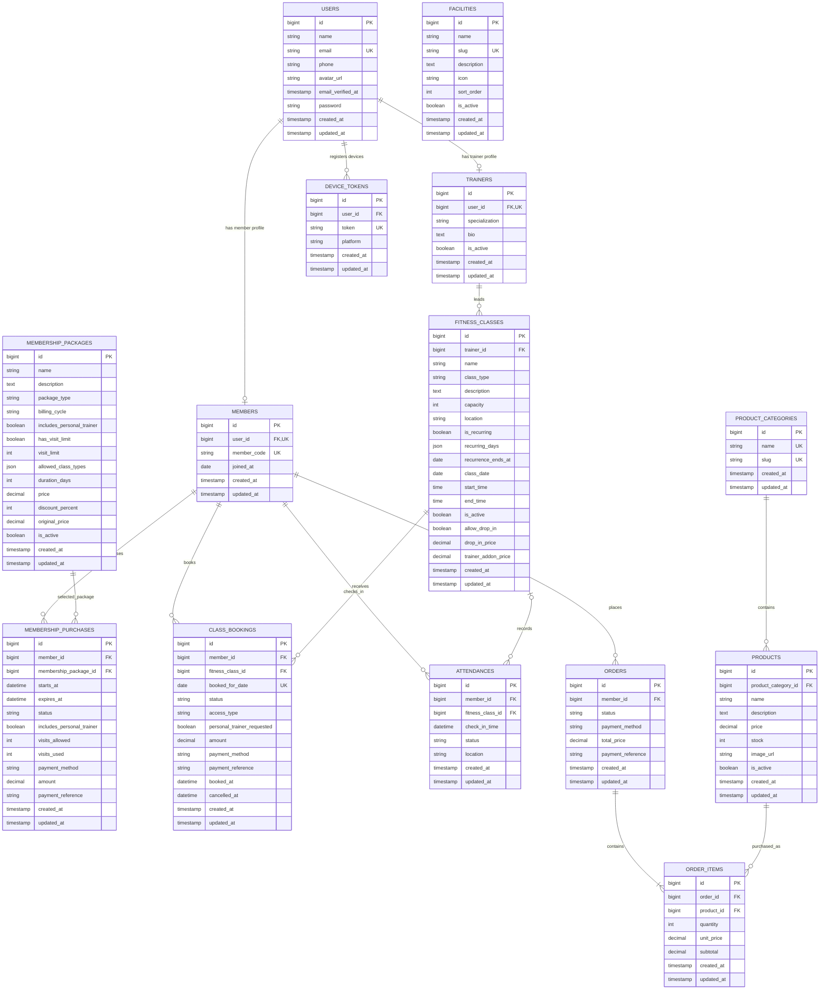
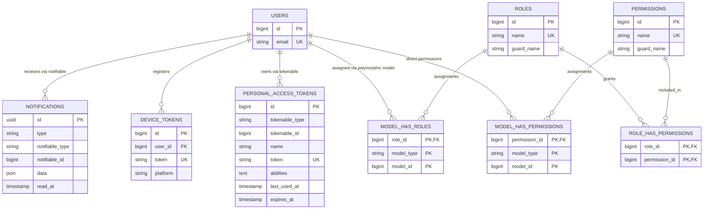
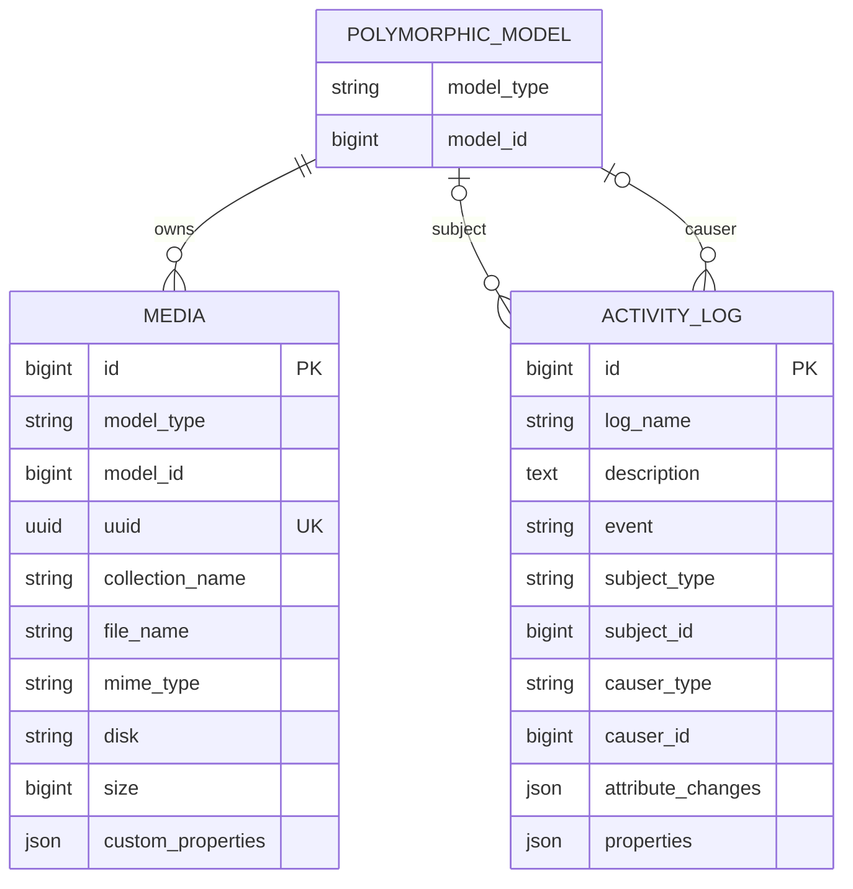

# Akhwat Gym Entity Relationship Diagram

This document reflects the final database shape produced by all migrations in `database/migrations`.

## Exports

- [High-resolution PNG](exports/akhwat-gym-erd.png)
- [Vector PDF](exports/akhwat-gym-erd.pdf)
- [Graphviz source](exports/akhwat-gym-erd.dot)

## Core Business Domain

### Core Constraints

- `members.user_id` and `trainers.user_id` are unique one-to-one profile links.
- A booking is unique by `member_id`, `fitness_class_id`, and `booked_for_date`.
- Deleting a member cascades to memberships, bookings, attendance, and orders.
- Deleting a fitness class cascades to bookings, but attendance keeps its record and sets `fitness_class_id` to null.
- Membership packages, trainers, product categories, and products use restrictive deletion where historical data depends on them.
- `facilities` is currently an independent catalog without a foreign-key relationship.

## Access, Authentication, and Notifications

The configured administrative roles are `Owner`, `Super admin`, and `Admin di lokasi`. The Spatie pivot tables are polymorphic, but this application currently assigns them to `App\\Models\\User`.

## Polymorphic Support Tables

## Framework Infrastructure Tables

The following tables are intentionally omitted from the relationship diagrams because they are framework storage rather than business entities:

- `password_reset_tokens`
- `sessions`
- `cache`
- `cache_locks`
- `jobs`
- `job_batches`
- `failed_jobs`
